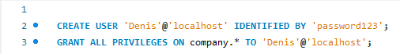

<h1>Task number 3. First I created a new database called "company" and executed the script:</h1>

 <h2>Then I created a user named 'Denis' which has all permissions required for the database company </h2>
 

 <h2>Then I wrote a query than returns the average salary for each department </h2>
 

